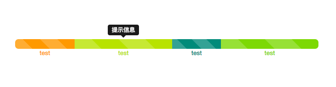

## Timeline - Tools

### Info

基于Bootstrap的时间轴插件

### Usage

```html
<div id="timeline""></div>
<script>
    var timeline = new Timeline(document.getElementById("timeline"));
    var tasks = [];
    //参数依次为：两个时间相差秒数，显示信息，提示信息，颜色
    var task = new Task(20000, "test", "提示信息","#FE9D01");
    tasks.push(task);//多时间段加入多个task
    timeline.setTasks(tasks);
    $("[data-toggle='tooltip']").tooltip();//bootstrap开启tooltip提示
</script>
```

### More

1. 若显示信息太长，则显示信息隐藏，与提示信息一同显示。

2. 颜色参数为可选项，若不设置颜色则会采用随机分配好的颜色。

### Screenshot


